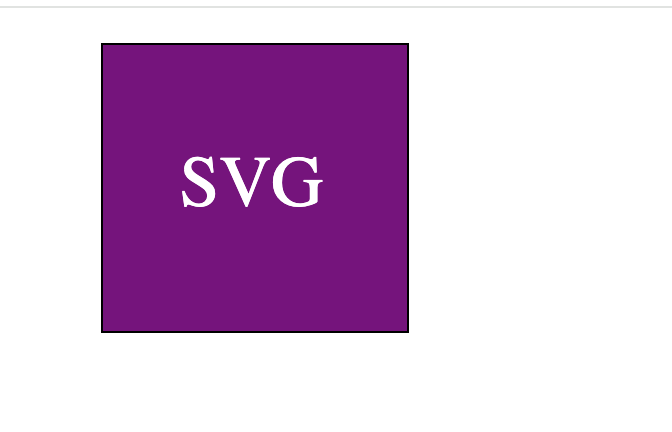

  # SVG Logo Generator 

   

  ## Description
This tool dynamically generates an SVG logo based on user input.  

  ## Table Of Contents

  - [Installation](#installation)
  - [Usage](#usage)
  - [How To Contrbute](#how-to-contribute)
  - [Testing Instructions](#testing-instructions)
  - [Questions](#questions)
  - [License](#license)

  ## Installation
To run the tool locally, follow these steps: <br>1. **Clone the repository:** ```bash git clone git@github.com:amritank/Logo_Generator.git```<br> 3. **Navigate to the project directory:** ```bash cd Logo_Generator```<br>3. **Install the dependencies:** ```bash npm install```<br>4. **Run the tool:** ```bash node index.js```<br><br>The tool presumes you have node.js installed. 

  ## Usage
Upon running the tool, the user will be prompted for: 1) Logo text 2) Logo text color 3) Logo shape - choose from circle, triangle and square 4) Logo shape  color.  The tool will use these inputs and genreate a logo  containing the  shape pased in and  logo text printed in the center of the shape.  The shape and text color are  based on user input.   Check the below images of the logos generated by the tool. <br><br>  <br>  <br><br> 

  ## How to Contribute
N/A 

  ## Testing Instructions
Execute the command: ```bash npm test``` to run unit tests. 

  ## Questions
## License
This project is licensed under the MIT License license. Visit [LICENSE](https://www.tldrlegal.com/license/mit-license) for details.